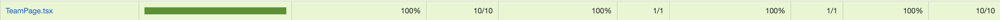

# Testing for MyPokeTeam
The tests ensure that all major components, pages, and routes function correctly and meet the expected behavior.

Here is the coverage of the components and pages tested:

Below is a detailed breakdown of the testing for each component.

### Banner test
__Test File:__ Banner.test.tsx

__Description:__ Tests the Banner component, which displays a banner with a title, text, and background images depending on the route (/ for root and /team for the team page).

__Test Cases:__
- Renders the correct text and image on the root path (/) in desktop view.
- Renders the correct text and image on /team in desktop view.
- Adjusts to mobile image when the viewport size is set to mobile dimensions.
- Matches snapshots for both desktop and mobile views.

### Favourites test
__Test File:__ Favorites.test.tsx

__Description:__ Tests the Favorites component, which manages a list of Pokémon and allows users to toggle them as favorites.

__Test Cases:__
- Renders with the correct Pokémon data.
- Matches snapshot for the component.
- Displays the correct number of PokemonCard components.
- Shows a message if no Pokémon are in the team.
- Restricts team name to a maximum of 20 characters.
- Toggles a Pokémon as favorite when the button is clicked.

### Filter test
__Test File:__ Filter.test.tsx

__Description:__ Tests the Filter component, which allows users to filter Pokémon by type.

__Test Cases:__
- Renders with correct props.
- Matches snapshot.
- Displays the correct number of options for filter types.
- Calls onFilterChange when a new filter is selected.
- Persists the filter value in sessionStorage.
- Restores the filter value from sessionStorage.

### Nav test
__Test File:__ Nav.test.tsx

__Description:__ Tests the Nav component, which displays a navigation bar with links to the home page and team page.

__Test Cases:__
- Navigates to the team page when the link is clicked.
- Navigates back to the homepage when the link is clicked.

### Pokemon Card test
__Test File:__ PokemonCard.test.tsx

__Description:__ Tests the PokemonCard component, which displays a Pokémon's name, image, and type.

__Test Cases:__
- Renders with correct Pokémon data, including name, image, and Pokedex number.

### Team page test
__Test File:__ TeamPage.test.tsx

__Description:__ Tests the TeamPage component, which displays a list of Pokémon that the user has added to their team.

__Test Cases:__
- Matches snapshot with correct props.

### Routing test
__Test File:__ Routing.test.tsx

__Description:__ Tests the routing integration to ensure that the correct components render based on different routes.

__Test Cases:__
- Renders the Root component on the homepage.
- Renders the TeamPage component on the /team route.
- Renders the ErrorPage for an invalid path.

